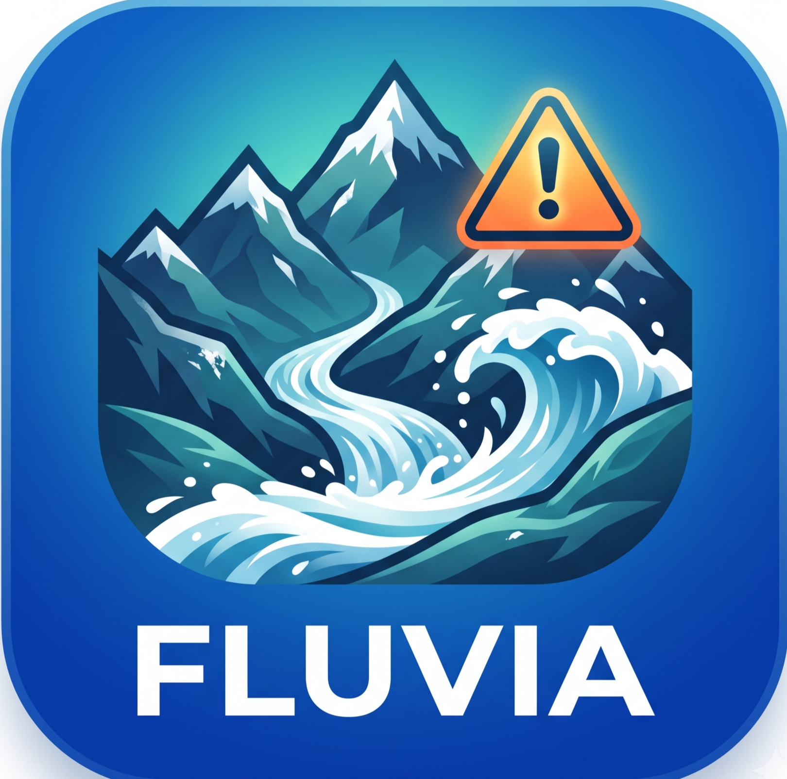

<p align="center">
  
</p>

<h1 align="center">FLUVIA</h1>
<h3 align="center">Catchment-Aware Flash-Flood & Landslide Early Warning Intelligence System</h3>

<p align="center">
  
  
  
  
  
</p>

<p align="center">
  <b>An AI-powered, real-time disaster intelligence platform for flash-flood and landslide early warning across India's vulnerable Himalayan and Western Ghats catchments.</b>
</p>

---

## 🌊 Problem Statement

Flash floods and landslides in India's mountainous regions (Uttarakhand, Wayanad, Himachal Pradesh) cause devastating loss of life due to:

- **Ungauged catchments** — 85%+ of Indian river basins lack real-time hydrological monitoring
- **Fragmented data sources** — IMD, CWC, ISRO, IoT sensors operate in silos
- **Insufficient lead time** — Current systems provide minutes, not the 30-60 minute window needed for evacuation
- **No hyper-local alerts** — Warnings are district-level, not ward/village-level

**FLUVIA** solves this with a catchment-aware, AI-driven, end-to-end pipeline that delivers **hyper-local, evidence-based early warnings with actionable evacuation routing**.

---

## 🏗️ Architecture & Pipeline

```
SENSE → HARMONIZE → MODEL → PREDICT → LOCALIZE → VERIFY → ALERT → ACT
```


---

## ✨ Key Features

### 🎯 Core Intelligence
| Feature | Description |
|---------|-------------|
| **Catchment-Level Risk Scoring** | Ward-by-ward composite risk index combining rainfall, soil saturation, slope stability, and river discharge |
| **Multi-Horizon Forecasting** | 30-min, 1-hour, 3-hour, and 6-hour prediction horizons with confidence intervals |
| **PUB Regionalization** | Prediction in Ungauged Basins — transfer hydrological knowledge from gauged donor catchments |
| **Evidence-Based Explainability** | Every alert shows *why* the area is at risk (dominant trigger + hydrological mechanism) |

### 📡 Data & Sensing
| Feature | Description |
|---------|-------------|
| **Multi-Source Harmonization** | Fuses IMD radar, CWC gauges, ISRO satellite, and IoT sensor data into a unified signal |
| **IoT Telemetry Grid** | Real-time monitoring of rain gauges, ultrasonic river sensors, soil moisture probes, and tilt meters |
| **Catchment-Averaged Rainfall Forcing (CARF)** | Spatially-weighted rainfall computation per catchment boundary |
| **API-7 Antecedent Wetness** | 7-day precipitation index for soil moisture state estimation |

### 🚨 Warning & Response
| Feature | Description |
|---------|-------------|
| **5-Level Color-Coded Alerts** | Green → Blue → Yellow → Orange → Red (CAP-compliant) |
| **Geofenced Warning Dispatch** | Target specific wards/villages within a configurable radius |
| **Evacuation Hub with SOS Beacon** | Safe shelter routing with real-time bed capacity tracking |
| **NDRF Command Center** | Multi-ward broadcast, resource deployment, and tactical simulation |

### 🗺️ Visualization
| Feature | Description |
|---------|-------------|
| **Interactive GIS Map** | Flutter Map with flood inundation polygons, sensor overlays, and evacuation corridors |
| **Risk Gauge Meter** | Real-time circular gauge showing composite risk score |
| **Lead Time Counter** | Live countdown of evacuation window |
| **Historical Digital Twin** | Replay past events (2021 Chamoli, 2024 Wayanad) |

---

## 🖥️ Screenshots

### Login Screen (Desktop & Mobile)
> Premium split-pane login with animated topographic background, role-based access (Citizen vs NDRF Authority)

### Operational Dashboard
> Real-time KPI cards, ward-level risk assessment, multi-horizon forecasts, and live sensor telemetry

### GIS Hazard Map
> Interactive map with flood inundation zones, sensor markers, and evacuation corridors

### 5-Level Warning Dispatch
> CAP-compliant alert composition with geofenced targeting

---

## 🛠️ Tech Stack

| Layer | Technology |
|-------|-----------|
| **Frontend** | Flutter 3.11+ (Material 3) |
| **State Management** | Provider |
| **Maps** | Flutter Map + LatLong2 |
| **Charts** | FL Chart |
| **Typography** | Google Fonts (Inter) |
| **Date Formatting** | intl |
| **Design System** | Custom AppColors + AppTheme (Government Enterprise Grade) |

---

## 📂 Project Structure

```
lib/
├── main.dart                          # App entry point
├── models/
│   ├── auth_user.dart                 # User authentication model
│   ├── catchment_model.dart           # Catchment hydrological model
│   ├── citizen_report.dart            # Crowdsourced report model
│   ├── disaster_alert.dart            # Alert/warning model
│   ├── evacuation_center.dart         # Safe shelter model
│   ├── sensor_data.dart               # IoT sensor telemetry model
│   └── ward_risk.dart                 # Ward-level risk assessment model
├── screens/
│   ├── login_screen.dart              # Premium login with role selection
│   ├── main_navigation_shell.dart     # AppBar + Drawer + Navigation
│   ├── dashboard_screen.dart          # Operational dashboard
│   ├── map_screen.dart                # Interactive GIS hazard map
│   ├── iot_sensors_screen.dart        # IoT telemetry grid
│   ├── warning_dispatch_screen.dart   # 5-level CAP alert dispatch
│   ├── evacuation_hub_screen.dart     # Safe shelter & SOS beacon
│   ├── citizen_report_screen.dart     # Crowdsourced ground reports
│   ├── command_center_screen.dart     # NDRF tactical operations
│   ├── pub_ungauged_catchment_screen.dart  # PUB regionalization
│   ├── data_harmonization_screen.dart # Multi-source data fusion
│   ├── model_validation_screen.dart   # LCO cross-validation
│   ├── historical_replay_screen.dart  # Digital twin replay
│   └── system_status_screen.dart      # System health telemetry
├── services/
│   ├── disaster_data_service.dart     # Core data service (Provider)
│   └── risk_calculation_engine.dart   # Risk scoring engine
├── theme/
│   ├── app_colors.dart                # Premium color system & gradients
│   └── app_theme.dart                 # Material 3 theme configuration
└── widgets/
    ├── app_logo.dart                  # Logo widget with glow effects
    ├── alert_banner.dart              # Alert notification banner
    ├── affected_locations_view.dart   # Affected area listing
    ├── citizen_alert_dialog.dart      # Targeted citizen alert popup
    ├── end_to_end_demo_wizard.dart    # Pipeline demo wizard
    ├── fluvia_sensing_matrix_card.dart # Sensor matrix visualization
    ├── interactive_risk_map.dart      # Embedded risk map widget
    ├── lead_time_counter.dart         # Evacuation countdown timer
    ├── live_location_tracker_bar.dart # GPS location tracker
    ├── risk_gauge_meter.dart          # Circular risk score gauge
    ├── sensor_telemetry_card.dart     # Sensor data card
    ├── simulation_control_panel.dart  # Disaster simulation controls
    └── weather_radar_card.dart        # Weather radar display
```

---

## 🚀 Getting Started

### Prerequisites

- **Flutter SDK** 3.11 or higher
- **Dart SDK** 3.11 or higher
- Android Studio / VS Code with Flutter extensions
- Git

### Installation

```bash
# 1. Clone the repository
git clone https://github.com/nithin-chatla/SIH2026.git
cd SIH2026

# 2. Install dependencies
flutter pub get

# 3. Run the app
flutter run
```

### Build for Production

```bash
# Android APK
flutter build apk --release

# Android App Bundle
flutter build appbundle --release

# Web
flutter build web --release

# Windows
flutter build windows --release
```

---

## 🔐 User Roles

FLUVIA supports two access levels:

### 👤 Citizen User
- View ward-level risk dashboard
- Access hazard maps and safe evacuation routes
- Receive hyper-local targeted alerts
- Submit crowdsourced ground reports with photos
- Activate SOS emergency beacon

### 🛡️ NDRF Authority / Official
- Full operational dashboard with all KPIs
- IoT sensor telemetry monitoring
- 5-level CAP-compliant warning dispatch
- Geofenced alert targeting
- NDRF Command Center with simulation
- Access to research modules (PUB, LCO, Digital Twin)

### Quick Demo Login
The login screen provides **Quick Fill** buttons for instant access:
- **NDRF Officer** — Pre-filled authority credentials
- **Citizen** — Pre-filled citizen credentials

---

## 🔬 Research Modules

| Module | Purpose |
|--------|---------|
| **PUB Regionalization** | Transfer hydrological parameters from gauged to ungauged basins using physical similarity indices |
| **Data Harmonization** | Multi-source data fusion engine (CARF — Catchment-Averaged Rainfall Forcing) |
| **LCO Cross-Validation** | Leave-Catchment-Out validation for model generalization testing |
| **Historical Digital Twin** | Replay simulations of 2021 Chamoli disaster and 2024 Wayanad floods |
| **System Telemetry** | Real-time subsystem health monitoring and data quality registry |

---

## 🎨 Design Philosophy

FLUVIA follows a **Government Enterprise Grade** design system:

- **Material 3** with custom component theming
- **Premium card system** with multi-layer shadows
- **5-level color-coded risk visualization** (Green → Blue → Yellow → Orange → Red)
- **Google Fonts Inter** for clean, professional typography
- **Responsive design** — Desktop (NavigationRail), Tablet, Mobile (BottomNavigationBar)
- **Animated transitions** — Slide page transitions, fade-in effects, animated backgrounds
- **Dark gradient headers** for authoritative feel
- **Accessible** — High contrast ratios, clear visual hierarchy

---

## 🎯 Target Regions

| Region | Catchments | Key Risk |
|--------|-----------|----------|
| **Uttarakhand & Himalayas** | Chamoli, Joshimath, Alaknanda basin | GLOF, Flash Flood, Landslide |
| **Western Ghats** | Wayanad, Idukki, Munnar basin | Extreme rainfall, Debris flow |

---

## 👥 Team

Built for **Smart India Hackathon (SIH) 2026** — Government of India Initiative

---

## 📄 License

This project is licensed under the MIT License — see the [LICENSE](LICENSE) file for details.

---

## 🙏 Acknowledgments

- **NDRF** — National Disaster Response Force, for operational workflows reference
- **IMD** — India Meteorological Department, for weather data standards
- **CWC** — Central Water Commission, for hydrological data formats
- **ISRO** — Indian Space Research Organisation, for satellite data methodologies
- **Flutter** — Google's cross-platform UI toolkit

---

<p align="center">
  <b>Built with ❤️ for saving lives</b><br/>
  <sub>FLUVIA — Because every minute of lead time saves lives</sub>
</p>
